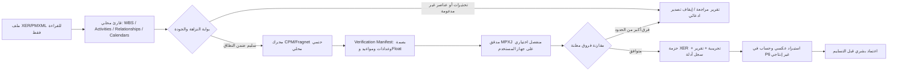

# مسار محرك P6/TIA والتحقق قبل الاعتماد

**الهدف:** إنتاج أرقام حتمية قابلة لإعادة الحساب والتدقيق للمطالبة، مع عدم تصوير TIA Studio على أنه Primavera P6 أو بديل مرخّص له قبل ثبوت التكافؤ في اختبار فعلي.  
**الحالة الحالية:** محرك CPM/Fragnet محلي وحتمي، وقارئ XER/PMXML للقراءة فقط، وتصدير XER تجريبي يحتاج تحقق استيراد عكسي.

## القرار التنفيذي

لا يوجد برنامج حر صغير يمكن نسخه بأمان داخل TIA Studio ليصبح «Primavera بالضبط». أدوات العرض العامة لا تكفي، وواجهات P6 الرسمية تفترض بيئة P6 مرخّصة ومثبتة، بينما MPXJ يصلح كمدقق مستقل محتمل لا كضمان مطابق لـ P6. [1] [2] [3]

لذلك يكون المسار الصحيح **طبقات تحقق، لا دمجاً أعمى**: يحسب محرك TIA Studio محلياً؛ ينتج ملف إثبات بالمدخلات والمخرجات؛ ثم يمر بمدقق مستقل محلي اختياري؛ وأخيراً—عند تسليم مطالبة—يستورد XER في نسخة P6 غير إنتاجية ويعاد حسابه هناك. لا تخرج ملفات المستخدم إلى سحابة أو GitHub في أي طبقة.

## ما يحسبه المحرك الآن وما لا يجوز افتراضه

| النطاق | موقف TIA Studio | شرط الاعتماد |
|---|---|---|
| شبكة الأنشطة، العلاقات، التأخيرات، فراغنت، CPM، ES/EF/LS/LF والـFloat | محلي وحتمي ويعاد حسابه من المدخل نفسه | اختبار مع بيانات مكتملة وتقرير جودة بلا حواجز |
| WBS، التقدم، الموارد والتكلفة المقروءة من P6 | تستخدم كبيانات سياقية/تدقيقية حيث يدعمها القارئ | لا تتحول إلى resource leveling أو cost claim تلقائي |
| تقاويم العمل والـlags والقيود | تقرأ وتفحص ضمن ما يدعمه المستورد | مقارنة تواريخ، تقاويم، وقيود مع P6 قبل اعتماد رقم نهائي |
| موارد P6 وresource leveling | ليست نسخة مكافئة من خوارزمية Primavera | لا يستخدم أي أثر levelled كرقم مطالبة إلا من P6 أو أداة مخصصة مختبرة |
| خيارات critical path مثل longest path، إعدادات float، وإصدارات P6 | قد تختلف دلالتها عن فرضيات محرك عام | تدوين إعدادات المشروع واختبارها على ملف P6 المرجعي |
| XER export | تجريبي ولا يثبت صحة الاستيراد وحده | استيراد عكسي وحساب يدوي في نسخة P6 غير إنتاجية |

> «حتمي» تعني أن المدخلات المتطابقة وإعدادات التقويم نفسها تنتج المخرجات نفسها داخل TIA Studio. ولا تعني، وحدها، مطابقة Primavera في إعداد أو إصدار أو خاصية لم تُختبر.

## ملف الإثبات Verification Manifest

ينشأ لكل تشغيل ناجح ملف JSON وملخص قابل للطباعة، ولا يحتوي على مرفقات الدليل الأصلية. يحفظ المعرف والبصمة الرقمية لـ: اسم المشروع، تاريخ البيانات، عدد WBS والأنشطة، العلاقات حسب نوعها، التقاويم، القيود، الإسنادات المقروءة والمستبعدة، إعدادات CPM، نطاق الـFragnet، تاريخ نهاية قبل/بعد، فرق المدة، قائمة الأنشطة الحرجة، ومقاييس الـFloat.

لا يسمح المسار بإعلان «نتيجة صالحة للتقديم» إذا وجدت علاقات أو إسنادات مستبعدة غير مراجعة، أو معرّفات نشاط مكررة، أو تقويم مفقود، أو تاريخ بيانات متعارض، أو فرق بين المدققين يزيد الحدود المعتمدة للمشروع. يحفظ كذلك رقم نسخة المحرك وقواعد الجودة حتى يمكن إعادة الحساب لاحقاً.

| المقارنة بين محرك TIA وP6/مدقق مستقل | حد القبول المبدئي | الإجراء إن خالف |
|---|---|---|
| عدد WBS/الأنشطة/العلاقات/التقاويم | تطابق كامل | إيقاف واعتماد تقرير استبعاد/فقد بيانات |
| معرفات العلاقات ونوعها وlag | تطابق كامل | إيقاف التصدير وفتح تقرير فروق |
| تاريخ بداية/نهاية المشروع | تطابق حسب التقويم والـData Date المعتمدين | مراجعة إعدادات التقويم والقيود قبل تكرار الحساب |
| المسار الحرج والـFloat | مقارنة مفصلة مع تعريف critical path المستخدم | توثيق اختلاف longest path/float ورفض وصف التطابق |
| مدة أثر الـFragnet | تساوٍ تحت إعدادات موثقة | مراجعة نشاط الربط والعلاقات والتقويم والقيود |

هذه الحدود **ليست نتائج افتراضية**؛ هي قواعد رفض/مراجعة. لا تُملأ نتيجة المقارنة إلا من ملف P6 حقيقي أو مدقق محلي معتمد للحالة نفسها.

## المسارات الممكنة للتكامل

| المسار | ما يحتاجه | ما يقدمه | قرار التنفيذ الحالي |
|---|---|---|---|
| محرك TIA Studio الداخلي + Manifest | لا خدمة خارجية | حساب Fragnet/CPM قابل لإعادة التشغيل وتحذيرات جودة | يُعزز أولاً لأنه تحت اختبارنا الكامل |
| MPXJ verifier اختياري | Java محلي، مراجعة LGPL، تشغيل كعملية منفصلة | قراءة/كتابة XER وPMXML وحساب CPM مستقل للمقارنة؛ توثق المكتبة أنها تسعى لمقاربة نتائج CPM لا لضمان P6 | نموذج أولي فقط بعد حزمة اختبارات مرجعية وترخيص توزيع [1] |
| جسر P6 Professional محلي | جهاز Windows، P6 مرخّص، Java وIntegration API الرسمية، موافقة المستخدم | تشغيل/قراءة داخل بيئة العميل؛ لا يعمل من المتصفح مباشرة | تصميم مستقبلي، read-only ثم تصدير تحت تأكيدات صريحة [2] |
| P6 EPPM REST | خادم P6 EPPM مرخّص، حساب وصلاحيات وواجهة API | تكامل مؤسسي مع المشروع والخادم وليس نسخة سطح مكتب خفيفة | لا يدمج دون موافقة مالك النظام وبيانات اتصال مؤمنة [3] |
| ProjectLibre/xer4PowerBI | تطبيق منفصل أو Power Query | عرض عام أو استخراج جداول فقط | مستبعدان من المحرك ومن التصدير؛ لا نسخ GPL/CPAL [4] [5] |

## تصميم جسر P6 عند توفر بيئة العميل

يبنى الجسر مستقبلاً كـ**P6 Bridge Local Companion** منفصل عن واجهة الويب، ولا يبدأ تلقائياً ولا يملك صلاحيات شبكة دائمة. يطلب المستخدم موافقته عند كل عملية، ويعرض قبل التنفيذ اسم المشروع والمسار والوضع: قراءة، حساب داخل P6، أو تصدير. يبدأ بقراءة project snapshot وملف manifest فقط. لا تنفذ أوامر كتابة أو حذف أو تغيير تقويم أو موارد إلا بعد شاشة تأكيد ثانية وتسجيل سجل تدقيق محلي قابل للتصدير.

لا يُبنى تحكم بالماوس أو الواجهة (UI automation) كطريق افتراضي لأنه هش ويعتمد على اللغة والإصدار وحالة النافذة. التكامل المقبول هو API الرسمي في بيئة P6 مرخّصة أو الاستيراد/التصدير المنضبط عبر ملفات. واجهة P6 Professional Integration API تحتاج Java وبيئة Primavera المناسبة؛ أما REST فهو مسار P6 EPPM الخادمي، وليس موصلاً محلياً مجانياً. [2] [3]

## التنفيذ الحالي: P6 Reconciliation Manifest

نُفذ ملف المطابقة المحلي في `client/src/lib/p6-reconciliation-manifest.ts` ويظهر زر تنزيله في تقرير المطالبة بعد تشغيل **TIA مفرد لحدث Fragnet واحد**. يحوي بصمة FNV-1a للاتساق (وليست توقيعاً أمنياً)، وبيانات البرنامج والتقويم والعدادات والعلاقات حسب نوعها، ونتيجة CPM، وتحذيرات الاستيراد، ومؤشرات علاقات/موارد XER المستبعدة، ونتيجة TIA. لا يُفعّل الزر لتحليل النوافذ حتى لا يخلط نتيجة متعددة النوافذ بمقارنة حدث واحد.

تثبت الاختبارات أن الملف حتمي، ويرفض خلط نتيجة CPM من برنامج آخر، ويتطلب خط أساس Pre‑TIA الصحيح عند وجود نتيجة TIA. ويثبت اختبار الواجهة أن زر الملف يظل معطلاً عندما تكون النتيجة تحليل نوافذ فقط. لا يقرأ أو يكتب الملف المصدر، ولا يجعل التصدير أو الحساب مطابقاً لـ P6 من تلقاء نفسه.

## أول تنفيذ آمن تالٍ

العمل التالي المفيد ليس نسخ مكتبة خارجية، بل إضافة **جدول فروق Reconciliation** إلى جانب ملف Manifest عند توفر مخرجات P6 أو مدقق مستقل. بعد اختبار ذلك على عينات حقيقية مجهّلة، يمكن بناء MPXJ verifier في عملية مستقلة لا تُضمّن في الحزمة، ثم اختبار ثلاث حالات على P6 الحقيقي: جدول طبيعي، Fragnet بتأخير، وحالة تقاويم/قيود. فقط إذا تطابقت النتائج ضمن الحدود أعلاه يمكن تقديم خيار اختياري للمستخدم باسم «تحقق متقاطع» لا «نسخة Primavera».

## المراجع

[1] [MPXJ: Primavera formats وCPM schedulers](https://www.mpxj.org/supported-formats/)  
[2] [Oracle: P6 Professional Integration API](https://docs.oracle.com/cd/F37128_01/English/Integration/p6_and_p6_pro_api_programming/55383.htm)  
[3] [Oracle: P6 EPPM REST API](https://docs.oracle.com/cd/F37125_01/English/Integration_Documentation/rest_api/index.html)  
[4] [ProjectLibre source repository](https://github.com/claur/ProjectLibre)  
[5] [xer4PowerBI source repository](https://github.com/shift-construction/xer4PowerBI)
